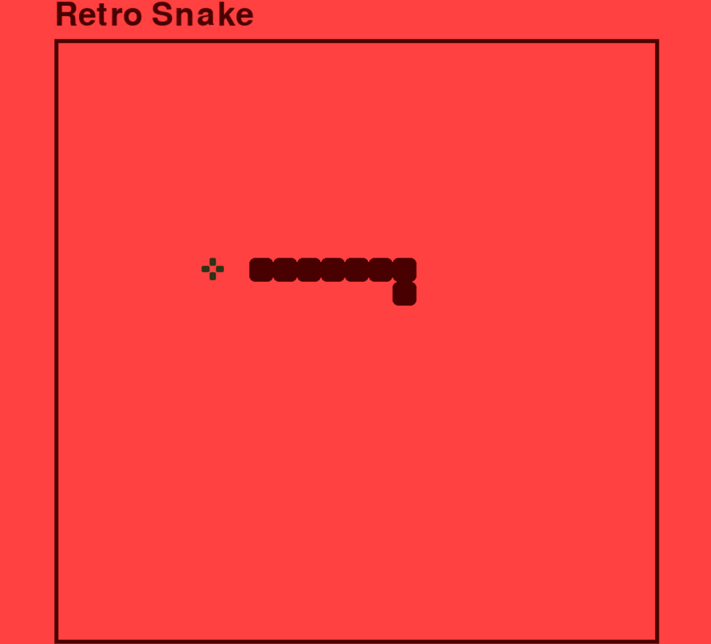

# Retro Snake Game // 

Here is the classic Snake game, a simple yet incredibly addictive experience. While it may seem basic by today’s standards, it was a huge success in its time. I developed this version using Python and the Pygame library.

Despite its simplicity, Snake incorporates many fundamental elements of game development, such as movement, controls, collision detection, scoring, and more. To enhance the experience, I also added sounds to the game.

### Features

- Classic Snake gameplay.
- Sound effects for key actions like eating food or hitting the wall.
- Adjustable game speed.
- Score tracking.
- Simple and intuitive controls.

### Game Visuals

  
  

### How to Play

- Use the arrow keys to control the snake's movement:
  - Up: Move up
  - Down: Move down
  - Left: Move left
  - Right: Move right
- Eat the food to grow the snake and increase your score.
- Avoid colliding with the walls or the snake's own body.

### Technologies Used

- Python: Core language for the game logic.
- Pygame: Library for game development and handling graphics and sound.

  
