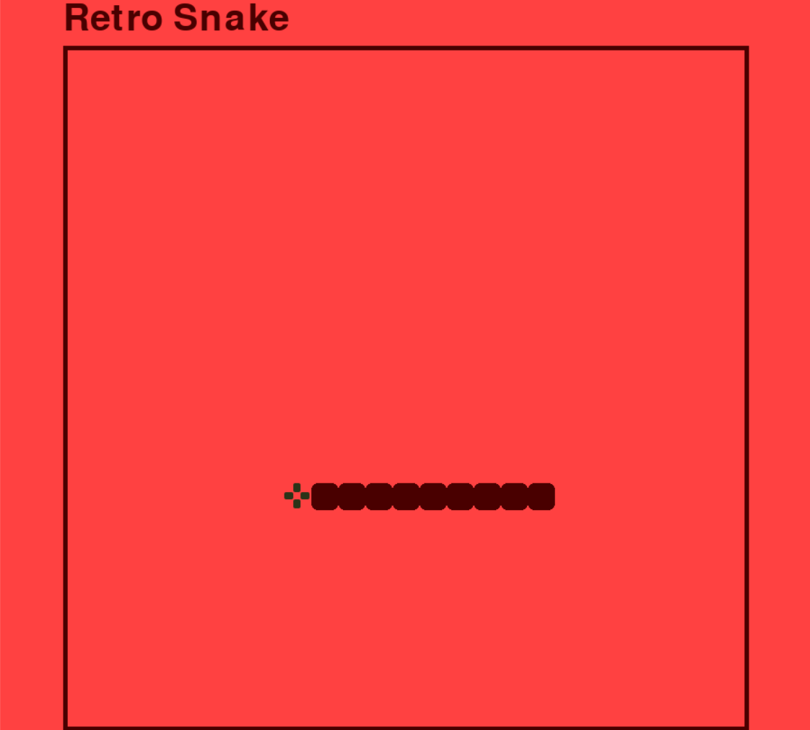

# Retro Snake Game // Python & Pygame

Here is the classic Snake game, a simple yet incredibly addictive experience. While it may seem basic by today’s standards, it was a huge success in its time. I developed this version using Python and the Pygame library.

Despite its simplicity, Snake incorporates many fundamental elements of game development, such as movement, controls, collision detection, scoring, and more. By learning to program Snake, you’ll gain the skills needed to create a wide variety of other games.

# Pictures

  

